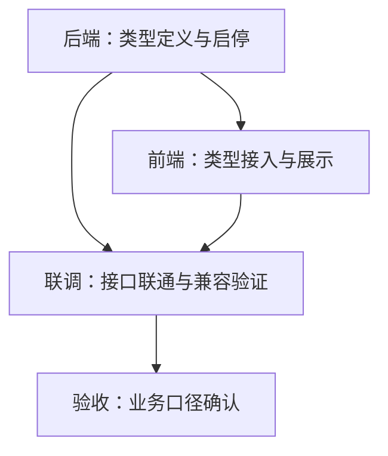

# 资产类型注册与启用机制

**ID:** STORY-E009-S001  
**史诗:** E009 资产类型底座与差异化框架  
**优先级:** P0  
**故事点:** 3

## 用户故事

作为系统管理员，我希望系统能明确区分固定资产、不动产、低值易耗品三种资产类型，并支持启用或停用，以便后续按类型配置字段、流程和统计口径。

## 验收标准

- [ ] 系统中存在明确的资产类型定义，且至少包含固定资产、不动产、低值易耗品。
- [ ] 资产类型可启用或停用，停用后不可被新的业务单据选择。
- [ ] 资产主档和相关页面能正确识别当前资产类型。
- [ ] 现有固定资产数据在类型体系下保持兼容，不影响原有查询和编辑。
- [ ] 类型列表或字典接口可以被前端稳定读取。

## 技术说明

- 该故事的目标不是增加更多表单字段，而是建立类型层的稳定入口。
- 类型信息应尽量保持在统一的枚举或字典层，避免前端和后端各自维护一套口径。
- 现有 `asset_info` 仍然作为基础台账承载主体，类型字段应成为后续模板和流程分支的入口。

## 前置依赖

- `asset_info` 现有台账模型
- 现有资产分类字典
- 固定资产现有页面与流程

## 完成定义

- [ ] 代码完成并通过编译
- [ ] 相关单测或接口测试通过
- [ ] 文档同步更新
- [ ] 代码审查通过
- [ ] 前端能按类型识别并限制可选范围

## 工单级拆分

这一层把 `STORY-E009-S001` 拆成可以直接分派给后端、前端、联调和验收的任务。默认顺序是先后端，再前端，再联调，最后验收。

### 后端工单

**目标**

建立资产类型的稳定数据源、启停状态和对外接口，确保前端只从统一口径读取类型信息。

**任务清单**

1. 定义资产类型基础数据结构
   - 明确固定资产、不动产、低值易耗品三个类型的编码、名称、状态和排序字段。
   - 确保类型定义可从字典、枚举或配置表中统一读取。

2. 增加类型启用/停用能力
   - 允许管理员停用某个资产类型。
   - 停用后，新增单据、新增主档和筛选条件都不能再选择该类型。

3. 提供标准类型查询接口
   - 输出可供前端下拉框、表单初始化和页面路由使用的类型列表。
   - 保持接口返回结构稳定，避免前端自行拼装类型口径。

4. 保持现有固定资产兼容
   - 确认 `asset_info` 旧数据仍能被正常读取、编辑和查询。
   - 不修改原有固定资产流程的关键字段含义。

**依赖**

- `asset_info` 现有台账模型
- 现有资产分类字典
- 固定资产现有接口和查询逻辑

**完成标准**

- 类型接口返回稳定
- 停用类型不可再被新业务选择
- 固定资产旧数据不受影响

### 前端工单

**目标**

让前端页面只依赖统一的类型接口，并能在新增、编辑、查询和详情中识别当前类型。

**任务清单**

1. 接入类型下拉与缓存
   - 新增类型读取 API 调用。
   - 在新增页面、编辑页面、筛选区和详情页中复用同一份类型数据。

2. 约束类型可选范围
   - 对停用类型做前端过滤。
   - 对已有资产的类型展示做只读处理，避免误改历史数据。

3. 在主档页面显示当前类型
   - 在列表、详情和表单页明确展示当前资产类型。
   - 让用户在固定资产、不动产、低值易耗品之间有清晰感知。

4. 为后续模板化渲染预留接入点
   - 把类型信息从页面参数、路由或表单上下文中透传出去。
   - 避免后续 `E009-S002` 再回头重构页面结构。

**依赖**

- 后端类型接口
- 现有 `asset_info` 页面
- 现有前端资产模块路由和 API 目录

**完成标准**

- 前端能稳定读取类型列表
- 停用类型不会出现在新增选择中
- 页面能正确显示当前资产类型

### 联调工单

**目标**

验证后端类型口径、前端展示和旧数据兼容是否一致，确保类型底座可以进入下一步扩展。

**任务清单**

1. 校验类型列表联通
   - 确认前端读取到的类型列表和后端返回值一致。
   - 确认停用状态在前端和后端都被正确识别。

2. 校验新增与编辑流程
   - 验证新增资产时只能选启用类型。
   - 验证编辑历史资产时不会因为类型状态导致页面异常。

3. 校验旧数据兼容
   - 验证历史固定资产记录仍可正常查询、编辑和导出。
   - 验证类型字段补齐后不会影响旧页面默认值。

4. 校验类型上下文传递
   - 验证路由、表单、详情和列表之间的类型上下文一致。
   - 为后续模板渲染和类型化主档改造确认入口没有断点。

**依赖**

- 后端工单完成
- 前端工单完成

**完成标准**

- 新增、编辑、查询的类型选择行为一致
- 停用类型不会进入业务流
- 旧数据路径无回归

### 验收工单

**目标**

从业务视角确认 `E009-S001` 真正完成，确保它可以作为后续 `E009-S002 / S003 / S004` 的稳定底座。

**验收点**

1. 资产类型定义清晰
   - 能明确看到固定资产、不动产、低值易耗品三种类型。
   - 类型状态可见且语义清楚。

2. 类型启停行为正确
   - 启用类型可正常选择。
   - 停用类型不能再被新的业务单据选择。

3. 现有资产流程不回退
   - 固定资产原有查询、编辑和新增路径可继续使用。
   - 不因引入类型层而打坏旧主档。

4. 前端读取稳定
   - 类型列表或字典接口可被稳定读取。
   - 前端不会为了显示类型而维护额外的临时映射。

**验收顺序**

1. 先看接口返回是否正确。
2. 再看前端页面是否正确接入。
3. 再看新增和编辑路径是否正确限制。
4. 最后看旧数据是否保持兼容。

### 依赖图

### 建议执行顺序

1. 先做后端工单，确保类型源头稳定。
2. 再做前端工单，确保页面只读统一口径。
3. 接着做联调工单，检查启停、兼容和上下文传递。
4. 最后做验收工单，把它关成可推进下一故事的底座。
