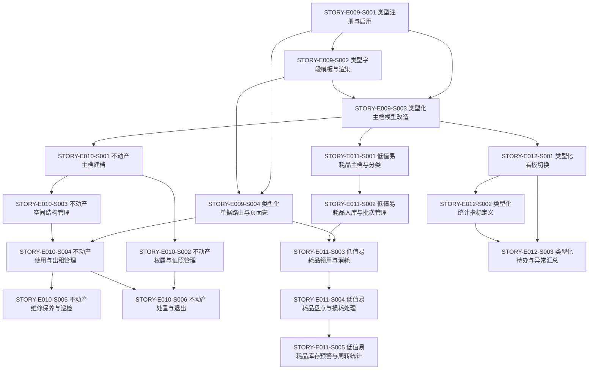
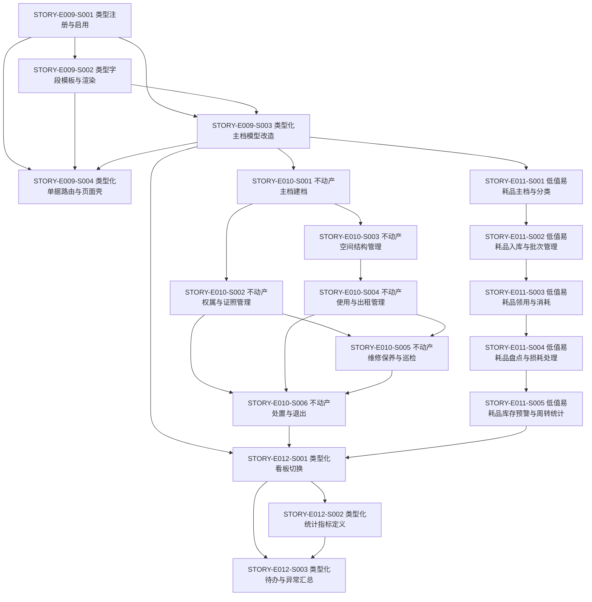

# 资产类型扩展实施计划

> **For agentic workers:** REQUIRED SUB-SKILL: Use superpowers:subagent-driven-development (recommended) or superpowers:executing-plans to implement this plan task-by-task. Steps use checkbox (`- [ ]`) syntax for tracking.

**Goal:** 将资产系统从“固定资产闭环”推进为“固定资产 + 不动产 + 低值易耗品”的类型化资产平台，并建立类型底座、差异化字段、类型化流程和类型化看板。

**Architecture:** 先固化资产类型底座，再分批落地不动产和低值易耗品，最后统一看板与异常汇总。所有类型共享 `category / info / event / shared` 的核心骨架，差异字段和差异流程通过模板、单据壳和类型规则下沉，避免复制页面和复制状态机。

**Tech Stack:** `RuoYi-Vue` 后端、`art-design-pro` 前端、现有资产模块、分类模板能力、事件流水、单据工作台壳、看板页。

---

## 1. 目标拆分

### 1.1 第一层目标

- 建立资产类型注册与启用机制。
- 建立类型字段模板与渲染规则。
- 将资产主档改造成“共用核心字段 + 类型扩展字段”。
- 让单据工作台支持按类型路由和按类型渲染。

### 1.2 第二层目标

- 落地不动产主档、权属、空间、使用、维护和处置。
- 落地低值易耗品主档、入库、领用、消耗、盘点和预警。
- 让看板和待办能够按类型切换和汇总。

---

## 2. 依赖图

---

## 3. 推荐实施顺序

### Wave 1: 类型底座先行

1. `STORY-E009-S001` 类型注册与启用机制
2. `STORY-E009-S002` 类型字段模板与渲染规则
3. `STORY-E009-S003` 类型化主档模型改造
4. `STORY-E009-S004` 类型化单据路由与页面壳

### Wave 2: 不动产主线

1. `STORY-E010-S001` 不动产主档建档
2. `STORY-E010-S002` 不动产权属与证照管理
3. `STORY-E010-S003` 不动产空间结构管理
4. `STORY-E010-S004` 不动产使用与出租管理
5. `STORY-E010-S005` 不动产维修保养与巡检
6. `STORY-E010-S006` 不动产处置与退出

### Wave 3: 低值易耗品主线

1. `STORY-E011-S001` 低值易耗品主档与分类
2. `STORY-E011-S002` 低值易耗品入库与批次管理
3. `STORY-E011-S003` 低值易耗品领用与消耗
4. `STORY-E011-S004` 低值易耗品盘点与损耗处理
5. `STORY-E011-S005` 低值易耗品库存预警与周转统计

### Wave 4: 类型化收口

1. `STORY-E012-S001` 类型化看板切换
2. `STORY-E012-S002` 类型化统计指标定义
3. `STORY-E012-S003` 类型化待办与异常汇总

---

## 4. 更细任务顺序

### 4.1 Wave 1 内部顺序

1. 先做类型注册，确保系统知道有哪些资产类型。
2. 再做模板渲染，确保前端可以按类型切字段。
3. 然后改主档模型，确保不同类型都能落在统一底座上。
4. 最后补单据路由和页面壳，确保后续扩类型不再重复造壳。

### 4.2 Wave 2 内部顺序

1. 先做不动产主档，确保有统一入口。
2. 再做权属证照和空间结构，明确不动产的对象是什么。
3. 然后做使用与出租，跑通不动产的日常业务闭环。
4. 接着做维修保养与巡检，补齐维护能力。
5. 最后做处置与退出，形成完整生命周期。

### 4.3 Wave 3 内部顺序

1. 先做低值易耗品主档，确保有数量型底座。
2. 再做入库与批次，建立库存来源。
3. 然后做领用与消耗，建立数量流转。
4. 接着做盘点与损耗，保证账实一致。
5. 最后做预警与统计，形成运营收口。

### 4.4 Wave 4 内部顺序

1. 先做类型化看板切换，统一入口。
2. 再做类型化指标定义，确保看板口径正确。
3. 最后做待办与异常汇总，形成管理层收口。

---

## 5. 分阶段交付物

### Wave 1 交付物

- 资产类型启用/停用能力
- 类型字段模板渲染规则
- 类型化主档模型
- 类型化单据工作台壳

### Wave 2 交付物

- 不动产主档页面
- 不动产权属与证照管理
- 不动产空间树
- 不动产使用/出租流程
- 不动产维修保养与巡检
- 不动产处置与退出

### Wave 3 交付物

- 低值易耗品主档页面
- 批次与入库能力
- 领用与消耗闭环
- 盘点与损耗处理
- 库存预警与周转统计

### Wave 4 交付物

- 类型化看板切换
- 类型化统计指标定义
- 类型化待办与异常汇总

---

## 6. 执行原则

1. 先立类型底座，再写具体类型页面。
2. 不动产与低值易耗品都不应复制固定资产字段全集。
3. 核心字段稳定放在主档里，类型差异通过模板和流程承载。
4. 看板和待办必须基于类型口径，不要使用混合统计。
5. 每个 Wave 都应该形成可独立验收的业务闭环。

---

## 7. 风险提示

### 风险 1：类型底座不稳，后面全部返工

- 表现：字段模板、页面壳、单据路由都在后面反复改。
- 应对：Wave 1 必须先把类型注册、模板和主档改造做扎实。

### 风险 2：不动产和固定资产字段混用

- 表现：页面越来越长，字段越来越重，查询越来越难。
- 应对：坚持“共用核心字段 + 类型扩展字段”。

### 风险 3：低值易耗品被做成设备台账

- 表现：数量型资产被塞进责任人、位置、维修等重字段。
- 应对：低值易耗品优先围绕数量、单位、批次、库存设计。

### 风险 4：看板过早做复杂图表

- 表现：看板做得很漂亮，但没有稳定口径。
- 应对：先做类型切换和指标定义，再做更多图表。

---

## 8. 下一步建议

如果要继续按 BMAD 走，建议下一步直接把这份计划转成：

1. `E009` 的开发任务拆分
2. `E010` 的开发任务拆分
3. `E011` 的开发任务拆分
4. `E012` 的开发任务拆分

这样每个 Wave 都能再拆成：
- 后端任务
- 前端任务
- 联调任务
- 验收任务

## 9. 建议落地方式

1. 先确认 `E009` 作为下一轮迭代的起点。
2. 再按 `E010`、`E011`、`E012` 依次排期。
3. 每个 Wave 都单独形成一个可验收的 sprint。
4. 避免把不动产和低值易耗品直接塞进固定资产页面里。

## 10. 故事级执行拆分

这一层把前面的 Wave 再往下拆，直接变成可以分派给开发、联调和验收的任务顺序。原则是先打穿 `E009` 类型底座，再让 `E010` 和 `E011` 在统一底座上各自成线，最后由 `E012` 做管理层收口。

### 10.1 `E009` 任务树

`E009` 是后续所有故事的根节点，建议作为第一轮迭代的唯一主线。

- `STORY-E009-S001` 类型注册与启用机制
  - 任务 1：定义资产类型枚举、字典或配置源，统一输出固定资产、不动产、低值易耗品三个类型。
  - 任务 2：补充类型启用/停用状态，并让停用类型不能出现在新增单据和新增主档的可选项里。
  - 任务 3：把类型读取接口暴露给前端，确保列表和下拉框只依赖同一条口径。
  - 任务 4：回归固定资产现有查询、编辑和新增路径，确认旧数据不受影响。

- `STORY-E009-S002` 类型字段模板与渲染规则
  - 任务 1：定义类型字段模板数据结构，明确哪些字段属于共用核心，哪些字段属于类型扩展。
  - 任务 2：让后端返回可渲染的字段元数据，避免前端手写三套字段清单。
  - 任务 3：实现前端模板渲染器，使表单、详情和查询区都能按类型切换字段。
  - 任务 4：补充模板回归测试，确认字段顺序、必填校验和显隐规则一致。

- `STORY-E009-S003` 类型化主档模型改造
  - 任务 1：梳理 `asset_info` 中必须保留的核心字段，冻结成共用底座。
  - 任务 2：新增类型扩展字段承载方式，支持不同类型挂载不同扩展字段集。
  - 任务 3：补充兼容迁移或回填逻辑，确保现有固定资产数据能平滑进入新模型。
  - 任务 4：校验查询、编辑、列表和详情接口，确认类型分支不会把旧数据打坏。

- `STORY-E009-S004` 类型化单据路由与页面壳
  - 任务 1：把单据入口改成按类型路由，先识别类型再进入页面。
  - 任务 2：把页面壳从“固定资产专用壳”改成“资产类型通用壳”。
  - 任务 3：把新增、编辑、详情、待办、审批等入口接入类型上下文。
  - 任务 4：验证后续新增类型只需要补模板和规则，不需要再复制页面壳。

### 10.2 `E010` 任务树

`E010` 不动产建议按“主档 -> 权属/空间 -> 使用/出租 -> 维修 -> 处置”的顺序推进，其中 `S002 / S003` 可以在主档稳定后并行。

- `STORY-E010-S001` 不动产主档建档
  - 任务 1：定义不动产主档的基础实体、DTO 和查询条件。
  - 任务 2：补齐新增、编辑、查询页面，先把不动产的统一入口做出来。
  - 任务 3：接入附件或证照关联入口，为后续权属管理留钩子。
  - 任务 4：确认不动产主档不会挤占固定资产主档的旧流程。

- `STORY-E010-S002` 不动产权属与证照管理
  - 任务 1：定义权属人、证号、权利类型、证照状态等结构。
  - 任务 2：实现权属和证照的增删改查与附件管理。
  - 任务 3：把证照信息挂到不动产主档下，形成一条完整对象链。
  - 任务 4：补充到期、缺失或失效的基础校验。

- `STORY-E010-S003` 不动产空间结构管理
  - 任务 1：建立楼栋、楼层、房间、场地等空间树模型。
  - 任务 2：支持空间节点的维护、层级关系和状态管理。
  - 任务 3：把不动产主档与空间树关联，确保对象和空间能互相定位。
  - 任务 4：为后续使用、出租和巡检提供空间维度。

- `STORY-E010-S004` 不动产使用与出租管理
  - 任务 1：定义自用、空置、出租、借用、停用等使用状态。
  - 任务 2：实现使用登记、租赁登记和状态流转。
  - 任务 3：把租期、承租方、租金或使用期限等字段接入流程。
  - 任务 4：和空间结构联动，保证一处空间在同一时刻只能处于合理状态。

- `STORY-E010-S005` 不动产维修保养与巡检
  - 任务 1：定义维修单、保养单和巡检记录的最小字段集。
  - 任务 2：支持基于不动产主档或空间节点发起维修保养。
  - 任务 3：把维修记录回写到主档形成资产健康档案。
  - 任务 4：补充周期巡检和到期提醒的基础逻辑。

- `STORY-E010-S006` 不动产处置与退出
  - 任务 1：定义处置、转让、报废、退出等结束态。
  - 任务 2：实现不动产处置申请、审批和归档。
  - 任务 3：让处置结果同步影响权属、空间和使用状态。
  - 任务 4：保留处置历史，便于后续审计和统计。

### 10.3 `E011` 任务树

`E011` 低值易耗品建议按“主档 -> 入库 -> 领用 -> 盘点 -> 预警”的顺序推进，先保证数量流，再补损耗和运营统计。

- `STORY-E011-S001` 低值易耗品主档与分类
  - 任务 1：定义低值易耗品主档、分类、单位和数量字段。
  - 任务 2：实现新增、编辑、查询和状态维护。
  - 任务 3：把低值易耗品主档从固定资产语义里剥离出来。
  - 任务 4：为后续批次和入库提供唯一主数据入口。

- `STORY-E011-S002` 低值易耗品入库与批次管理
  - 任务 1：定义入库单、批次号和来源信息。
  - 任务 2：实现批量入库和库存初始化。
  - 任务 3：把入库结果回写到主档和库存台账。
  - 任务 4：支持按批次追溯来源和状态。

- `STORY-E011-S003` 低值易耗品领用与消耗
  - 任务 1：定义领用单和消耗单的最小字段集。
  - 任务 2：实现按数量扣减的流转逻辑。
  - 任务 3：把领用对象、部门、人员和用途记录下来。
  - 任务 4：保证库存数量、领用记录和主档状态一致。

- `STORY-E011-S004` 低值易耗品盘点与损耗处理
  - 任务 1：定义盘点单、盘点差异和损耗原因。
  - 任务 2：实现账实差异的录入和调整。
  - 任务 3：把损耗、报损和盘盈盘亏结果沉淀到库存台账。
  - 任务 4：保留盘点历史，方便后续审计。

- `STORY-E011-S005` 低值易耗品库存预警与周转统计
  - 任务 1：定义低库存、临期和高周转预警规则。
  - 任务 2：实现按类型、分类、部门和批次的库存统计。
  - 任务 3：把预警输出到待办或告警入口。
  - 任务 4：支持运营层查看周转和消耗趋势。

### 10.4 `E012` 任务树

`E012` 是收口层，建议放在 `E010` 和 `E011` 都具备稳定主线之后再做，这样看板口径不会反复改。

- `STORY-E012-S001` 类型化看板切换
  - 任务 1：实现按资产类型切换看板入口。
  - 任务 2：让同一看板壳承载不同类型的基础卡片。
  - 任务 3：确保切换后保留统一的筛选和返回逻辑。
  - 任务 4：验证固定资产、不动产、低值易耗品都能进入自己的看板视图。

- `STORY-E012-S002` 类型化统计指标定义
  - 任务 1：梳理各类型的核心指标口径。
  - 任务 2：把指标定义和资产类型绑定，避免混算。
  - 任务 3：输出可以被看板复用的指标配置。
  - 任务 4：补充与主档、入库、处置、维修等业务的一致性校验。

- `STORY-E012-S003` 类型化待办与异常汇总
  - 任务 1：定义待办、异常和超期的统一口径。
  - 任务 2：让不同资产类型的待办按照类型分组展示。
  - 任务 3：把异常汇总接到管理层入口。
  - 任务 4：确保待办和异常统计可以随类型切换。

## 11. 故事级依赖图

## 12. 更建议的下一步

如果你要继续往下推进，我建议下一步直接把 `E009` 再拆成开发工单级别：

1. `E009-S001` 的后端字典/接口/状态位任务
2. `E009-S002` 的模板结构/渲染器/前端接入任务
3. `E009-S003` 的主档模型/兼容迁移/查询改造任务
4. `E009-S004` 的路由壳/页面壳/入口改造任务

这样后面每一个故事都能复用同一套拆法，不会再回到“页面堆字段”的老路上。
